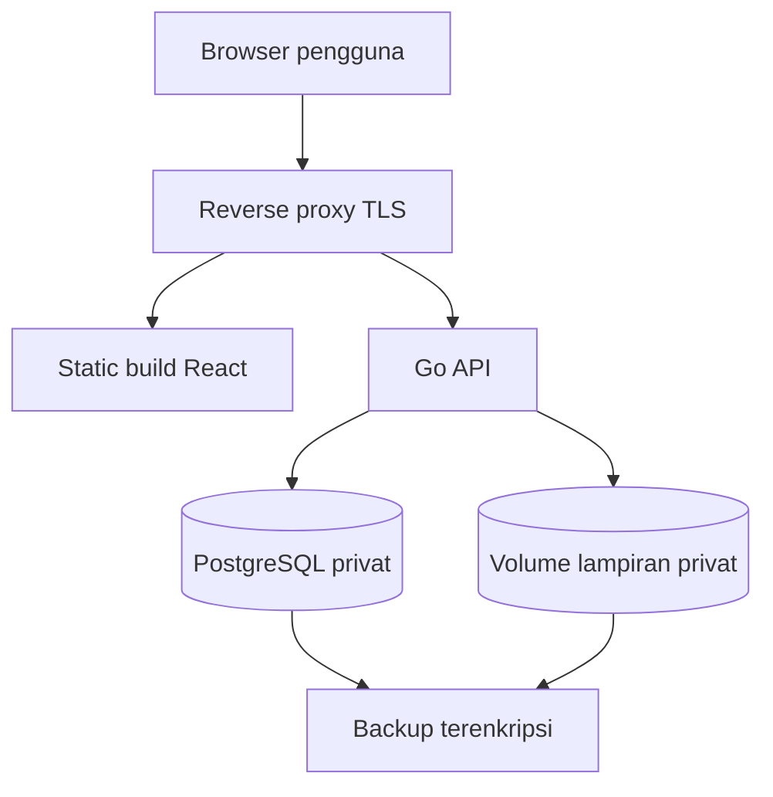

# Software Architecture — RANDesk

Versi 1.0 · 26 September 2026 · Cakupan arsitektur MVP dan jalur evolusi

## 1. Ringkasan keputusan

Gunakan modular monolith: satu proses API Go dengan modul bisnis yang jelas, satu PostgreSQL, penyimpanan lampiran privat, dan SPA React. Frontend serta API disajikan dari origin yang sama melalui reverse proxy. Keputusan ini membatasi beban operasional untuk pengembang individual dan tetap memungkinkan pengujian tiap lapisan.

| Lapisan | Pilihan baseline | Tujuan |
| --- | --- | --- |
| Frontend | React, TypeScript strict, Vite | UI interaktif dengan build terpisah |
| Routing | React Router | Navigasi, nested layout, route guard UX |
| Server state | TanStack Query | Fetch, cache terotorisasi, invalidation, polling |
| Styling | Tailwind CSS dengan token DESIGN | Konsistensi tampilan |
| HTTP API | Go dan Gin | Routing, middleware, adapter HTTP |
| Database access | `database/sql` dengan driver pgx | SQL eksplisit, pooling, transaksi |
| Database | PostgreSQL | FK, constraints, row locks, transaksi |
| Migrasi | golang-migrate atau tool setara yang dipilih pada kickoff | Migrasi SQL berurutan; kunci satu tool setelah dipilih |
| Storage | Direktori privat pada persistent volume | Lampiran MVP satu instance |
| Proxy | Caddy atau Nginx; pilih satu pada kickoff | TLS, static assets, routing API |

Versi tepat ditetapkan saat inisialisasi dan dikunci dalam go.mod serta lockfile. Referensi pemilihan terdapat di [REFERENCES.md](REFERENCES.md). Dua pilihan operasional yang belum dikunci dicatat sebagai D-02 dan D-03 pada DECISIONS.

## 2. Topologi deployment MVP

Hanya reverse proxy yang menerima trafik publik. PostgreSQL dan volume tidak diekspos ke internet. `/api/v1/*` menuju API; route SPA menuju index.html; path lampiran tidak mempunyai public static mapping. Lihat OPERATIONS untuk urutan backup konsisten.

## 3. Struktur kode yang direncanakan

| Path rencana | Isi |
| --- | --- |
| `backend/cmd/api/` | Entry point, konfigurasi, dependency wiring, shutdown |
| `backend/cmd/admin/` | Bootstrap admin dan prosedur operator terbatas |
| `backend/internal/auth/` | Login, sessions, password, CSRF |
| `backend/internal/users/` | Akun, aktivitas, departemen |
| `backend/internal/tickets/` | Lifecycle, assignment, policy, query tiket |
| `backend/internal/comments/` | Komentar publik/internal |
| `backend/internal/attachments/` | Validasi dan adapter storage |
| `backend/internal/notifications/` | Notifikasi persisten dan read state |
| `backend/internal/dashboard/` | Query agregat sesuai scope |
| `backend/internal/audit/` | Audit administratif |
| `backend/internal/platform/` | DB, logging, clock, ID, HTTP middleware |
| `backend/migrations/` | Migrasi SQL bernomor |
| `frontend/src/app/` | Router, providers, layout |
| `frontend/src/features/` | auth, tickets, notifications, dashboard, admin |
| `frontend/src/components/` | Komponen shared |
| `frontend/src/lib/` | API client, error mapping, date utilities |
| `docs/` | Paket dokumen Markdown ini |

Path tersebut adalah target struktur repo, bukan berkas kode yang telah dibuat.

## 4. Arah dependensi

Handler menerima dan memvalidasi bentuk request, lalu memanggil service. Service menjalankan policy, aturan bisnis, dan transaksi melalui repository. Repository berisi SQL berparameter. Storage diakses melalui interface supaya backend bisnis tidak bergantung pada path filesystem.

Service tidak menerima `gin.Context`; gunakan `context.Context`, actor yang telah diautentikasi, serta DTO input. Domain error dipetakan oleh HTTP adapter. Repository tidak menentukan HTTP status atau izin UI.

Policy pusat menyediakan pemeriksaan read, edit, comment, assignment, dan transition. Query scope daftar dan aggregate menggunakan policy yang sama. Hindari tiga salinan logika izin yang berbeda untuk detail, export, dan dashboard.

## 5. Siklus request

1. Request ID, recovery, batas body, log durasi, dan timeout dipasang.
2. Middleware membaca token cookie, mencari hash sesi, serta memeriksa expiry, revocation, dan akun aktif.
3. Request mutasi melewati validasi Origin dan CSRF; login mempunyai perlakuan khusus pada SECURITY.
4. Handler decode dengan penolakan field asing; service memeriksa izin objek dan aturan bisnis.
5. Repository menjalankan query atau transaksi; DTO disusun dengan allowlist field.
6. Respons konsisten mengandung request_id. Log tidak mencatat body, cookie, atau token.

Timeout awal: query normal 3 detik; handler JSON 10 detik; upload 60 detik dengan pembatas byte. Gunakan context turunan; hindari goroutine yang hidup tanpa pembatalan.

## 6. Batas transaksi dan konkurensi

### 6.1 Mutasi tiket

Gunakan transaksi `READ COMMITTED` dengan row lock. Operasi inti membaca tiket dalam scope dengan `SELECT ... FOR UPDATE`, memeriksa expected_version dan state, memperbarui tiket, menulis event, memasukkan notifikasi, lalu commit. Semua query transaksi memakai objek transaksi yang sama.

Pola UPDATE inti tetap memakai `WHERE id = $id AND version = $expected` sebagai pertahanan tambahan, lalu memeriksa jumlah row. Rollback otomatis dijadwalkan sampai commit berhasil. Kegagalan event/notifikasi menggagalkan keseluruhan perubahan.

### 6.2 Assignment dan status akun

Assignment mengunci akun teknisi target terlebih dahulu (`FOR UPDATE`), memeriksa role/active, lalu mengunci tiket. Jika beberapa akun perlu dikunci, urutkan UUID. Penonaktifan akun mengunci akun target sebelum memeriksa tiket open/in_progress miliknya. Penonaktifan tidak mengambil ticket lock; jika ditemukan tiket aktif, tolak.

Pemilihan kategori/departemen baru mengambil shared row lock pada master terkait sebelum menulis referensi. Mutasi status aktif master mengambil row lock yang berkonflik, sehingga status aktif tidak berubah di tengah pemilihan referensi. Urutan lock yang digunakan ketika diperlukan: advisory lock administrasi → master data → user berdasarkan UUID → ticket. Hindari transaksi yang mengambil urutan sebaliknya.

Seluruh perubahan aktivasi admin diserialisasi menggunakan satu advisory transaction lock yang kuncinya tetap untuk instalasi, kemudian cek jumlah admin aktif. Ini mencegah dua admin dinonaktifkan bersamaan hingga tidak ada admin aktif. Jangan mengambil user lock setelah ticket lock pada jalur yang juga dipakai assignment.

Aksi status memeriksa assignee aktif. Karena teknisi tidak dapat dinonaktifkan ketika masih mempunyai tiket open/in_progress, aturan ini stabil terhadap penonaktifan biasa. Akun aktif tetap dicek pada setiap request; request yang sudah berjalan saat pencabutan sesi dapat menyelesaikan transaksi yang sah.

### 6.3 Komentar dan lampiran

Komentar mengunci tiket untuk memeriksa status/izin terbaru, menulis komentar, event, notifikasi, serta first_response_at bila masih NULL. Version inti tidak berubah.

File dipindai ukuran/jenisnya ke staging privat terlebih dahulu. Setelah lolos, mulai transaksi, lock tiket, hitung lampiran aktif, lalu pindahkan file ke key final acak dan tulis metadata/event/notifikasi. Jika commit gagal, hapus file final sebagai kompensasi; log kegagalan cleanup untuk operator. File staging dan file final tanpa metadata yang lebih tua dari 24 jam dibersihkan oleh perintah maintenance setelah pemeriksaan referensi DB.

Delete lampiran menandai metadata `deleted_at` dan mencatat event dalam transaksi; download langsung menolaknya. Penghapusan byte dilakukan setelah commit dan diulang maintenance bila gagal. Database dan filesystem tidak dianggap satu transaksi atomik; kompensasi tersebut wajib diuji.

## 7. Autentikasi dan frontend state

Token sesi acak hanya berada pada cookie HttpOnly; database menyimpan hash token. CSRF token acak terikat sesi dan diberikan lewat JSON, disimpan sementara di memori frontend. Route `/auth/me` memulihkan user serta CSRF token setelah reload.

API dan SPA satu origin; Vite dev server memakai proxy `/api` ke Go. Tidak ada wildcard CORS ber-credentials. Ketika logout, sesi berakhir, atau akun berubah, kosongkan cache TanStack Query dan draft sensitif. Jangan menaruh token sesi di localStorage.

Query key menyertakan user ID dan filter relevan. Setelah mutation, invalidate list/detail/dashboard/notifikasi yang terkait. Catatan internal memakai query/cache terpisah dan tetap disaring backend.

## 8. Notifikasi MVP

Notifikasi dibuat sinkron dalam transaksi yang menghasilkan event. Frontend mengambil notifikasi dan unread_count setiap 30 detik saat tab aktif, juga setelah aksi sendiri. Unique constraint penerima/event mencegah penerima ganda dalam event yang sama.

Tidak diperlukan goroutine “fire-and-forget” untuk menjamin notifikasi MVP. Proses API yang berhenti tidak menghilangkan notifikasi yang telah commit. Notifikasi belum memiliki jaminan email atau push eksternal.

## 9. Evolusi P1

Jika SSE ditambahkan, stream hanya menjadi sinyal invalidation; klien membaca ulang sumber data melalui API yang sudah terotorisasi. Reconnect harus memicu refetch agar event yang terlewat tidak merusak state. Jangan mengirim objek internal langsung ke stream seluruh pengguna.

Pengingat SLA/email memerlukan tabel outbox, worker dengan klaim pekerjaan, retry terbatas, deduplication key, status gagal, serta observability. Efek eksternal bersifat at-least-once; penerima harus ditangani secara idempoten. Desain schema/API tambahan harus dibuat sebelum implementasi P1.

Satu instance dan disk lokal menjadi batas scaling MVP. Sebelum menambah replika API, pindahkan lampiran ke object storage bersama dan koordinasikan rate limiting serta distribusi event. Perubahan ke microservices memerlukan alasan operasional terukur dan ADR baru.

## 10. Keandalan dan observability

- `/health/live` memeriksa proses; `/health/ready` memeriksa kesiapan DB dan akses volume tanpa menampilkan detail rahasia.
- Log JSON: timestamp, level, request_id, route template, method, status, duration_ms, actor_id bila tersedia.
- Ukur error rate, latency, penggunaan pool DB, disk, dan kegagalan upload/cleanup.
- Shutdown menghentikan penerimaan request, memberi waktu maksimal 15 detik untuk pekerjaan aktif, lalu menutup pool.
- Gunakan binary dan image yang dapat direproduksi; backup dan rollback dijabarkan pada OPERATIONS.
