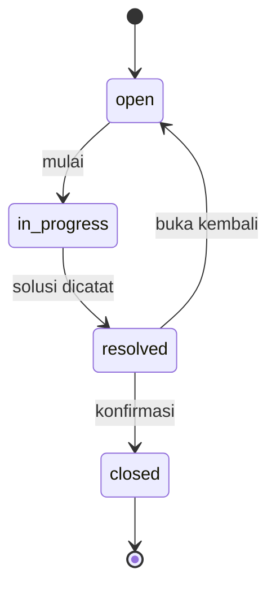

# Business and Development Rules — RANDesk

Versi 1.0 · 26 September 2026 · Dokumen normatif aturan bisnis

## 1. Peran perencana dan pelaksana

### Peran

Bertindak sebagai product engineer yang memahami analisis kebutuhan, Go, frontend berbasis komponen, database relasional, dan pengujian keamanan. Gunakan spesifikasi sebagai kontrak kerja dan jelaskan trade-off ketika mengusulkan perubahan.

### Objektif

Membangun MVP RANDesk yang dapat dijalankan, diuji, dan dijelaskan dalam portofolio. Setiap milestone harus menghasilkan alur yang dapat diperiksa, bukan sekadar kumpulan komponen.

### Konteks

Proyek dikerjakan pengembang individual dengan pengalaman PHP/Laravel yang sedang memperluas kemampuan Go dan React. Produk melayani satu organisasi dan tiga peran. Dokumen [PRD.md](PRD.md) menentukan scope.

### Batasan

Ikuti P0 terlebih dahulu; jangan menambah fitur P1/P2, layanan eksternal, dependensi besar, atau mengubah kontrak secara diam-diam. Jangan memasukkan secret, data pengguna nyata, atau klaim hasil pengujian yang belum dijalankan. Instruksi pemilik proyek tetap menjadi dasar perubahan scope; dokumentasikan keputusan yang berubah.

## 2. Matriks izin

`Milik sendiri` berarti `tickets.requester_id = user.id`; `ditugaskan` berarti `tickets.assignee_id = user.id`. Semua aksi membutuhkan akun aktif dan sesi yang valid. Staff berarti technician atau admin.

| Aksi | Requester | Technician | Admin |
| --- | --- | --- | --- |
| Membuat tiket untuk diri sendiri | Ya | Ya | Ya |
| Melihat daftar/detail, lampiran, event publik | Milik sendiri | Semua tiket | Semua tiket |
| Mengubah judul/deskripsi/kategori | Milik sendiri, hanya open | Tidak | Semua, kecuali closed |
| Mengubah prioritas | Tidak setelah dibuat | Tidak | Kecuali closed; alasan wajib |
| Melihat komentar/event internal | Tidak | Semua tiket | Semua tiket |
| Menambah komentar publik | Milik sendiri, selain closed | Ditugaskan, selain closed | Semua, selain closed |
| Menambah komentar internal | Tidak | Ditugaskan, selain closed | Semua, selain closed |
| Claim tiket | Tidak | Open, assignee kosong, untuk diri sendiri | Melalui assignment |
| Assignment/reassignment | Tidak | Hanya claim | Open/in_progress, ke teknisi aktif |
| Unassign | Tidak | Tidak | Hanya open |
| Mulai penanganan | Tidak | Ditugaskan | Ya, assignee harus terisi |
| Resolve | Tidak | Ditugaskan | Ya, memenuhi aturan status |
| Close | Milik sendiri | Hanya jika reporter sendiri | Semua |
| Reopen | Milik sendiri | Hanya jika reporter sendiri | Semua |
| Upload lampiran | Milik sendiri, open/in_progress | Ditugaskan, open/in_progress | Semua, open/in_progress |
| Hapus lampiran | Pengunggah sendiri dan punya akses, open/in_progress | Pengunggah sendiri dan masih ditugaskan, open/in_progress | Semua, open/in_progress |
| Dashboard | Scope tiket sendiri | Semua tiket | Semua tiket |
| Kelola akun/master data | Tidak | Tidak | Ya |
| Membaca audit administratif | Tidak | Tidak | Ya |

Teknisi yang bukan assignee boleh membaca untuk koordinasi, tetapi tidak mengubah tiket. Setelah assignment berpindah, teknisi lama kehilangan izin mutasi. Endpoint pilihan assignee hanya mengembalikan teknisi aktif kepada staff. Tidak ada hard delete tiket melalui API.

## 3. Lifecycle

| Transisi | Pelaku | Syarat dan perubahan |
| --- | --- | --- |
| open → in_progress | Assignee atau admin | Assignee adalah teknisi aktif; set first_response_at bila memenuhi definisi PRD |
| in_progress → resolved | Assignee atau admin | `resolution_summary` 20–4.000 karakter; set resolved_at dan resolved_by; catat solusi publik |
| resolved → closed | Reporter atau admin | Set closed_at dan closed_by; tidak mengubah solusi |
| resolved → open | Reporter atau admin | `reason` 10–1.000 karakter; kosongkan assignee dan seluruh field resolusi/penutupan; increment reopen_count |

Tidak ada transisi lain atau penutupan otomatis dalam MVP. Solusi lama tetap tersedia dalam event publik. Reopen tidak mengubah created_at atau first_response_at. Closed bersifat read-only untuk isi tiket, komentar, dan lampiran; aksi tandai notifikasi dibaca tetap boleh.

## 4. Aturan bisnis

| ID | Aturan |
| --- | --- |
| BR-01 | Reporter berasal dari sesi dan tidak dapat diubah; satu tiket hanya memiliki satu assignee saat ini |
| BR-02 | Nomor tiket berasal dari sequence database, tampil `HD-000001`; angka dapat melompat dan tidak pernah dipakai ulang |
| BR-03 | Assignment tidak otomatis mengubah status. Open boleh sudah ditugaskan; in_progress/resolved/closed wajib memiliki assignee |
| BR-04 | Claim hanya untuk tiket open yang belum ditugaskan. Reassignment memerlukan alasan 10–1.000 karakter dan dilakukan admin |
| BR-05 | Semua perubahan inti menggunakan `expected_version`, row lock, pemeriksaan izin ulang, dan transaksi |
| BR-06 | Versi stale ditolak 409; tidak ada last-write-wins diam-diam. Request yang seluruh nilainya sama ditolak 422 `NO_CHANGE` |
| BR-07 | Hanya transisi pada tabel lifecycle yang diperbolehkan; CLOSED bukan sinonim RESOLVED |
| BR-08 | Prioritas `low`, `normal`, `high`, `urgent`; default normal. Reporter memilih saat membuat; hanya admin mengubahnya setelah dibuat dan menyertakan alasan |
| BR-09 | Komentar berupa plain text 1–5.000 karakter, append-only, visibility `public` atau `internal`. Requester hanya dapat membuat public |
| BR-10 | Catatan/event internal tidak masuk respons requester, pencarian, statistik komentar publik, atau notifikasinya |
| BR-11 | Maksimal 5 lampiran aktif per tiket; maksimal 5.242.880 byte per file; JPEG, PNG, PDF; tidak tersedia lampiran privat/internal pada MVP |
| BR-12 | Mutasi inti dan child yang menghasilkan aktivitas menyimpan event dan notifikasi dalam transaksi database yang sama |
| BR-13 | Jam server menjadi sumber waktu; UTC untuk penyimpanan/API, WITA untuk tampilan; durasi MVP memakai waktu kalender |
| BR-14 | Kategori/departemen dinonaktifkan, tidak dihapus; referensi historis tetap valid. Pemilihan baru wajib item aktif |
| BR-15 | Role akun immutable pada MVP. Admin tidak boleh menonaktifkan diri sendiri atau membuat sistem kehilangan admin aktif; teknisi dengan tiket open/in_progress harus direassign sebelum dinonaktifkan |
| BR-16 | Semua pagination, pencarian, aggregate, dan download memakai scope akses yang sama; mengetahui UUID tidak memberikan izin |
| BR-17 | Akun yang dinonaktifkan/reset password/berubah password kehilangan sesi; status akun diperiksa setiap request |
| BR-18 | Tiket, komentar, event, dan audit tidak mempunyai fitur hapus melalui UI/API; penghapusan data mengikuti prosedur operator terdokumentasi |

## 5. Konkurensi dan version

Perubahan inti adalah edit field tiket, assignment, dan transisi status. Ketiganya menaikkan `tickets.version` satu angka dan memperbarui `updated_at`. Request wajib membawa expected_version positif.

Penambahan komentar, penambahan/penghapusan lampiran, dan pengisian first_response_at dari komentar tidak menaikkan version inti. Operasi tersebut tetap mengunci tiket dan memeriksa status serta izin terbaru. `updated_at` berarti perubahan inti terakhir; waktu aktivitas child berasal dari event. Ini mencegah komentar baru menyebabkan konflik pada formulir metadata.

Urutan pemeriksaan: autentikasi → scope objek → lock → validasi role/akun terkait → expected_version → status/aturan → perubahan → event/notifikasi → commit. API tidak membocorkan current_version untuk objek di luar scope pengguna.

Assignment dan penonaktifan akun harus mengunci baris akun terkait lebih dahulu, diurutkan berdasarkan UUID, kemudian tiket. Operasi yang mengubah daftar admin aktif diserialisasi melalui satu advisory transaction lock. Detail transaksi terdapat di ARCHITECTURE.

## 6. Aturan notifikasi

| Event | Penerima |
| --- | --- |
| Tiket baru | Semua admin aktif |
| Assignment | Assignee baru dan reporter |
| Reassignment/unassign | Assignee lama, assignee baru bila ada, dan reporter |
| Status berubah | Reporter dan assignee saat ini; untuk reopen juga assignee lama |
| Komentar publik | Reporter dan assignee saat ini; jika belum ada assignee, admin aktif |
| Komentar internal | Assignee saat ini dan admin aktif; hanya staff |
| Prioritas/kategori/judul/deskripsi berubah | Reporter dan assignee saat ini |
| Lampiran ditambah/dihapus | Reporter dan assignee saat ini |

Hilangkan duplikasi penerima, akun nonaktif, dan aktor pemicu. Notifikasi hanya berisi ringkasan aman, ticket_id, dan event_id; jangan salin isi catatan internal atau lampiran ke notifikasi. `(recipient_id, event_id)` unik. Jika respons request hilang, penulisan ulang yang valid dapat menjadi event baru; deduplikasi event tidak sama dengan idempotency request.

## 7. Validasi input

Panjang dihitung sebagai karakter Unicode setelah trim untuk teks bisnis. Password tidak ditrim atau dipotong. Validasi frontend membantu pengguna; backend tetap otoritatif. Tanggal dan ID dari klien tidak boleh mengganti nilai sistem.

| Field | Batas |
| --- | --- |
| Nama pengguna | 2–100 karakter |
| Email | Maksimal 254 karakter; normalisasi trim + lowercase; unik |
| Password | 12–128 karakter; dukung passphrase dan spasi |
| Nama kategori/departemen | 2–80 karakter; unik tanpa membedakan kapitalisasi |
| Judul tiket | 5–150 karakter |
| Deskripsi tiket | 20–10.000 karakter |
| Ringkasan solusi | 20–4.000 karakter |
| Alasan keputusan | 10–1.000 karakter |
| Komentar | 1–5.000 karakter |
| Nama file tampilan | 1–180 karakter setelah sanitasi; tidak digunakan sebagai path |
| Search `q` | Maksimal 100 karakter; kosong berarti tanpa pencarian |

## 8. Aturan engineering

- Go: gunakan gofmt, context pada operasi I/O, error terstruktur, parameterized SQL, dan timeout eksplisit.
- Pisahkan handler HTTP, service bisnis, policy otorisasi, repository, dan adapter storage; hindari logika bisnis pada handler.
- React: TypeScript strict, komponen reusable sesuai kebutuhan, form terlabel, dan pemisahan server state dari state lokal.
- DTO API dibuat eksplisit; jangan serialisasikan struct database secara langsung.
- Gunakan satu REST API versi `/api/v1`; perubahan breaking memerlukan keputusan dan migrasi kontrak.
- Query pagination/sorting memakai daftar kolom yang diizinkan. Identifier SQL tidak dibangun dari input bebas.
- Parameter keamanan dan kredensial berasal dari konfigurasi lingkungan; contoh konfigurasi hanya berisi placeholder.
- Migrasi yang sudah dirilis tidak diedit; tambah migrasi baru yang kompatibel.
- Perubahan aturan bisnis menyertakan tes yang membuktikan perilaku dan pembaruan dokumen terkait.
- Simpan commit terfokus, jelaskan alasan perubahan, dan gunakan pull request atau catatan review meskipun proyek individual.
- Selesai berarti acceptance criteria terpenuhi, error/empty/loading states tersedia, dan bukti uji dicatat.

## 9. Aturan perubahan scope

Usulan fitur baru harus menyebut masalah pengguna, manfaat, biaya implementasi, data baru, dampak izin/API, dan prioritas. Catat sebagai backlog jika tidak diperlukan untuk P0. Perubahan besar dicatat sebagai ADR baru pada [DECISIONS.md](DECISIONS.md).
