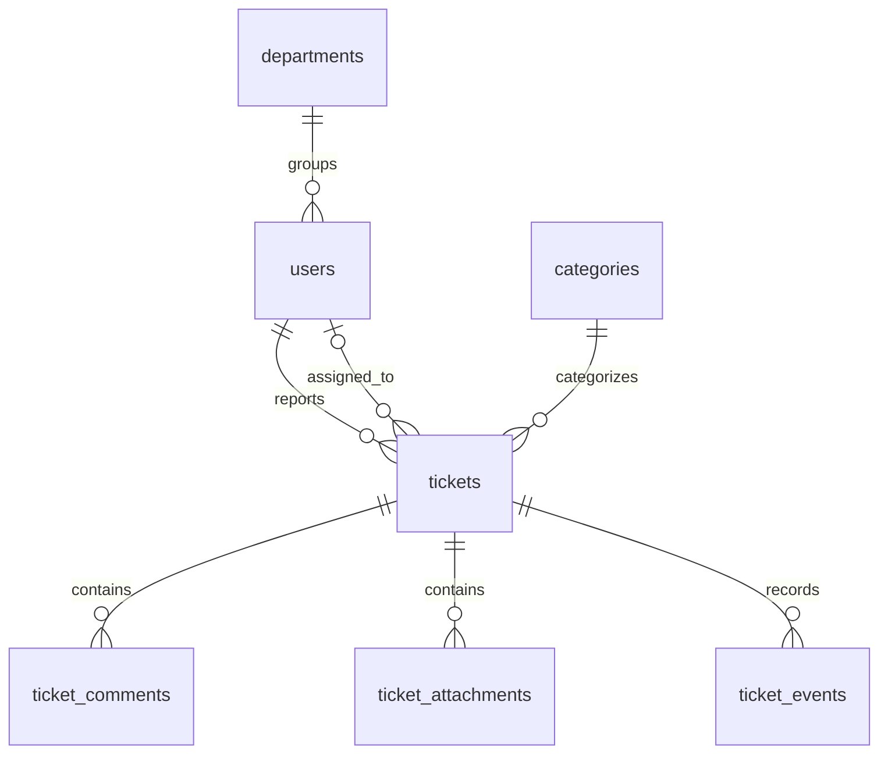
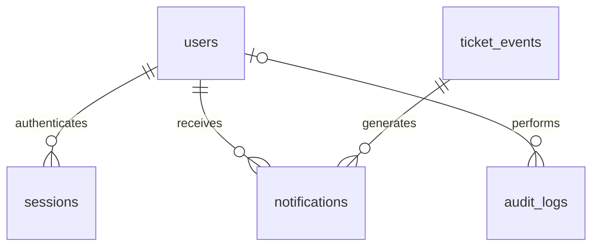

# Database Schema — RANDesk

Versi 1.0 · 26 September 2026 · Target: PostgreSQL

## 1. Konvensi penyimpanan

- Tabel dan kolom: snake_case, bahasa Inggris.
- Primary key domain: UUID dibuat aplikasi dengan generator aman; tidak membutuhkan extension database.
- Nomor tiket: BIGINT identity, ditampilkan API sebagai string `HD-` + angka minimal enam digit. Contoh angka 1000000 menjadi `HD-1000000`, tidak dipotong.
- Timestamps: `TIMESTAMPTZ`; koneksi dan respons API menggunakan UTC.
- Status dan role: TEXT dengan CHECK, sehingga perubahan enum melalui migrasi eksplisit lebih mudah ditinjau.
- Version: INTEGER positif untuk optimistic concurrency pada mutasi inti.
- Teks bisnis disimpan plain text setelah trim; password dan hash tidak ditrim.
- Database bukan sumber otorisasi lengkap: aturan role/ownership/status ditangani service, didukung constraints dan transaksi.

## 2. ERD inti



Relasi assignee opsional pada open. Komentar, lampiran, dan event masing-masing juga memiliki FK aktor ke users sebagaimana DDL. Satu user boleh tanpa departemen.



## 3. Data dictionary

| Tabel | Tujuan | Kolom penting dan aturan |
| --- | --- | --- |
| departments | Unit kerja | name unik case-insensitive; is_active menentukan pemilihan baru |
| categories | Pengelompokan masalah | name unik case-insensitive; deactivation menjaga referensi lama |
| users | Akun dan peran | email lowercase unik; password_hash format PHC; role immutable lewat service; is_active dan must_change_password |
| sessions | Sesi browser | token_hash SHA-256; csrf_token acak; expires_at absolut; revoked_at untuk pencabutan |
| tickets | State terkini | requester_id immutable; assignee_id opsional saat open; resolved/closed fields mengikuti status; version mutasi inti |
| ticket_comments | Percakapan | body append-only; visibility public/internal; author_id dicatat |
| ticket_attachments | Metadata berkas | storage_key privat; checksum; ukuran; soft delete dengan aktor |
| ticket_events | Timeline produk | event_type, visibility, payload allowlist, seq untuk urutan stabil |
| notifications | Pemberitahuan persisten | recipient_id + event_id unik; message aman; read_at opsional |
| audit_logs | Jejak administratif | actor_id opsional untuk operasi sistem; action, target, metadata allowlist, request_id |

`tickets.updated_at` hanya waktu perubahan inti. `first_response_at` dapat diisi satu kali oleh komentar publik tanpa bump version. Waktu aktivitas lain dibaca dari ticket_events. `resolved_at` adalah penyelesaian terbaru, sedangkan solusi sebelum reopen tetap berada pada event.

## 4. DDL baseline MVP

Blok berikut merupakan satu kandidat migrasi awal. Jalankan di database development kosong terlebih dahulu; verifikasi dengan PostgreSQL yang dipilih sebelum rilis. Tidak ada secret atau data akun seed dalam DDL.

```sql
BEGIN;

CREATE TABLE departments (
    id UUID PRIMARY KEY,
    name VARCHAR(80) NOT NULL CHECK (char_length(btrim(name)) BETWEEN 2 AND 80),
    description VARCHAR(500),
    is_active BOOLEAN NOT NULL DEFAULT TRUE,
    created_at TIMESTAMPTZ NOT NULL DEFAULT CURRENT_TIMESTAMP,
    updated_at TIMESTAMPTZ NOT NULL DEFAULT CURRENT_TIMESTAMP
);
CREATE UNIQUE INDEX departments_name_ci_uq ON departments (lower(name));

CREATE TABLE categories (
    id UUID PRIMARY KEY,
    name VARCHAR(80) NOT NULL CHECK (char_length(btrim(name)) BETWEEN 2 AND 80),
    description VARCHAR(500),
    is_active BOOLEAN NOT NULL DEFAULT TRUE,
    created_at TIMESTAMPTZ NOT NULL DEFAULT CURRENT_TIMESTAMP,
    updated_at TIMESTAMPTZ NOT NULL DEFAULT CURRENT_TIMESTAMP
);
CREATE UNIQUE INDEX categories_name_ci_uq ON categories (lower(name));

CREATE TABLE users (
    id UUID PRIMARY KEY,
    department_id UUID REFERENCES departments(id) ON DELETE RESTRICT,
    name VARCHAR(100) NOT NULL CHECK (char_length(btrim(name)) BETWEEN 2 AND 100),
    email VARCHAR(254) NOT NULL UNIQUE,
    password_hash TEXT NOT NULL,
    role TEXT NOT NULL CHECK (role IN ('requester', 'technician', 'admin')),
    is_active BOOLEAN NOT NULL DEFAULT TRUE,
    must_change_password BOOLEAN NOT NULL DEFAULT TRUE,
    created_at TIMESTAMPTZ NOT NULL DEFAULT CURRENT_TIMESTAMP,
    updated_at TIMESTAMPTZ NOT NULL DEFAULT CURRENT_TIMESTAMP,
    CONSTRAINT users_email_normalized_ck CHECK (
        email = lower(btrim(email)) AND char_length(email) BETWEEN 3 AND 254
    )
);
CREATE INDEX users_department_idx ON users (department_id);
CREATE INDEX users_role_active_idx ON users (role, is_active);

CREATE TABLE sessions (
    id UUID PRIMARY KEY,
    user_id UUID NOT NULL REFERENCES users(id) ON DELETE RESTRICT,
    token_hash CHAR(64) NOT NULL UNIQUE CHECK (token_hash ~ '^[0-9a-f]{64}$'),
    csrf_token VARCHAR(43) NOT NULL CHECK (csrf_token ~ '^[A-Za-z0-9_-]{43}$'),
    created_at TIMESTAMPTZ NOT NULL DEFAULT CURRENT_TIMESTAMP,
    expires_at TIMESTAMPTZ NOT NULL,
    revoked_at TIMESTAMPTZ,
    CONSTRAINT sessions_expiry_ck CHECK (expires_at > created_at),
    CONSTRAINT sessions_revoked_ck CHECK (revoked_at IS NULL OR revoked_at >= created_at)
);
CREATE INDEX sessions_user_idx ON sessions (user_id);
CREATE INDEX sessions_expiry_idx ON sessions (expires_at);

CREATE TABLE tickets (
    id UUID PRIMARY KEY,
    ticket_no BIGINT GENERATED ALWAYS AS IDENTITY UNIQUE,
    requester_id UUID NOT NULL REFERENCES users(id) ON DELETE RESTRICT,
    assignee_id UUID REFERENCES users(id) ON DELETE RESTRICT,
    category_id UUID NOT NULL REFERENCES categories(id) ON DELETE RESTRICT,
    title VARCHAR(150) NOT NULL CHECK (char_length(btrim(title)) BETWEEN 5 AND 150),
    description TEXT NOT NULL CHECK (char_length(btrim(description)) BETWEEN 20 AND 10000),
    priority TEXT NOT NULL DEFAULT 'normal'
        CHECK (priority IN ('low', 'normal', 'high', 'urgent')),
    status TEXT NOT NULL DEFAULT 'open'
        CHECK (status IN ('open', 'in_progress', 'resolved', 'closed')),
    version INTEGER NOT NULL DEFAULT 1 CHECK (version >= 1),
    first_response_at TIMESTAMPTZ,
    resolved_at TIMESTAMPTZ,
    resolved_by UUID REFERENCES users(id) ON DELETE RESTRICT,
    resolution_summary TEXT,
    closed_at TIMESTAMPTZ,
    closed_by UUID REFERENCES users(id) ON DELETE RESTRICT,
    reopen_count INTEGER NOT NULL DEFAULT 0 CHECK (reopen_count >= 0),
    created_at TIMESTAMPTZ NOT NULL DEFAULT CURRENT_TIMESTAMP,
    updated_at TIMESTAMPTZ NOT NULL DEFAULT CURRENT_TIMESTAMP,
    CONSTRAINT tickets_assignee_state_ck CHECK (
        status = 'open' OR assignee_id IS NOT NULL
    ),
    CONSTRAINT tickets_resolution_length_ck CHECK (
        resolution_summary IS NULL OR char_length(btrim(resolution_summary)) BETWEEN 20 AND 4000
    ),
    CONSTRAINT tickets_lifecycle_ck CHECK (
        (status IN ('open', 'in_progress')
            AND resolved_at IS NULL AND resolved_by IS NULL
            AND resolution_summary IS NULL AND closed_at IS NULL AND closed_by IS NULL)
        OR
        (status = 'resolved'
            AND resolved_at IS NOT NULL AND resolved_by IS NOT NULL
            AND resolution_summary IS NOT NULL AND closed_at IS NULL AND closed_by IS NULL)
        OR
        (status = 'closed'
            AND resolved_at IS NOT NULL AND resolved_by IS NOT NULL
            AND resolution_summary IS NOT NULL AND closed_at IS NOT NULL AND closed_by IS NOT NULL)
    ),
    CONSTRAINT tickets_time_order_ck CHECK (
        updated_at >= created_at
        AND (first_response_at IS NULL OR first_response_at >= created_at)
        AND (resolved_at IS NULL OR resolved_at >= created_at)
        AND (closed_at IS NULL OR closed_at >= resolved_at)
    )
);
CREATE INDEX tickets_requester_created_idx ON tickets (requester_id, created_at DESC, id DESC);
CREATE INDEX tickets_assignee_status_idx ON tickets (assignee_id, status, created_at DESC, id DESC);
CREATE INDEX tickets_status_created_idx ON tickets (status, created_at DESC, id DESC);
CREATE INDEX tickets_category_created_idx ON tickets (category_id, created_at DESC, id DESC);
CREATE INDEX tickets_created_idx ON tickets (created_at DESC, id DESC);

CREATE TABLE ticket_comments (
    id UUID PRIMARY KEY,
    ticket_id UUID NOT NULL REFERENCES tickets(id) ON DELETE RESTRICT,
    author_id UUID NOT NULL REFERENCES users(id) ON DELETE RESTRICT,
    visibility TEXT NOT NULL DEFAULT 'public' CHECK (visibility IN ('public', 'internal')),
    body TEXT NOT NULL CHECK (char_length(btrim(body)) BETWEEN 1 AND 5000),
    created_at TIMESTAMPTZ NOT NULL DEFAULT CURRENT_TIMESTAMP
);
CREATE INDEX comments_ticket_visibility_idx
    ON ticket_comments (ticket_id, visibility, created_at DESC, id DESC);
CREATE INDEX comments_author_idx ON ticket_comments (author_id);

CREATE TABLE ticket_attachments (
    id UUID PRIMARY KEY,
    ticket_id UUID NOT NULL REFERENCES tickets(id) ON DELETE RESTRICT,
    uploaded_by UUID NOT NULL REFERENCES users(id) ON DELETE RESTRICT,
    original_name VARCHAR(180) NOT NULL CHECK (char_length(original_name) BETWEEN 1 AND 180),
    storage_key TEXT NOT NULL UNIQUE,
    content_type TEXT NOT NULL CHECK (content_type IN ('image/jpeg', 'image/png', 'application/pdf')),
    size_bytes BIGINT NOT NULL CHECK (size_bytes BETWEEN 1 AND 5242880),
    sha256 CHAR(64) NOT NULL CHECK (sha256 ~ '^[0-9a-f]{64}$'),
    created_at TIMESTAMPTZ NOT NULL DEFAULT CURRENT_TIMESTAMP,
    deleted_at TIMESTAMPTZ,
    deleted_by UUID REFERENCES users(id) ON DELETE RESTRICT,
    CONSTRAINT attachments_delete_pair_ck CHECK (
        (deleted_at IS NULL AND deleted_by IS NULL)
        OR (deleted_at IS NOT NULL AND deleted_by IS NOT NULL AND deleted_at >= created_at)
    )
);
CREATE INDEX attachments_ticket_active_idx ON ticket_attachments (ticket_id, created_at)
    WHERE deleted_at IS NULL;
CREATE INDEX attachments_uploader_idx ON ticket_attachments (uploaded_by);

CREATE TABLE ticket_events (
    id UUID PRIMARY KEY,
    seq BIGINT GENERATED ALWAYS AS IDENTITY UNIQUE,
    ticket_id UUID NOT NULL REFERENCES tickets(id) ON DELETE RESTRICT,
    actor_id UUID NOT NULL REFERENCES users(id) ON DELETE RESTRICT,
    event_type TEXT NOT NULL CHECK (event_type IN (
        'ticket.created', 'ticket.updated', 'ticket.assigned', 'ticket.reassigned',
        'ticket.unassigned', 'ticket.started', 'ticket.resolved', 'ticket.closed',
        'ticket.reopened', 'ticket.comment_added', 'ticket.attachment_added',
        'ticket.attachment_deleted'
    )),
    visibility TEXT NOT NULL DEFAULT 'public' CHECK (visibility IN ('public', 'internal')),
    payload JSONB NOT NULL DEFAULT '{}'::jsonb CHECK (jsonb_typeof(payload) = 'object'),
    created_at TIMESTAMPTZ NOT NULL DEFAULT CURRENT_TIMESTAMP
);
CREATE INDEX events_ticket_seq_idx ON ticket_events (ticket_id, seq DESC);
CREATE INDEX events_actor_idx ON ticket_events (actor_id);

CREATE TABLE notifications (
    id UUID PRIMARY KEY,
    recipient_id UUID NOT NULL REFERENCES users(id) ON DELETE RESTRICT,
    event_id UUID NOT NULL REFERENCES ticket_events(id) ON DELETE RESTRICT,
    message VARCHAR(200) NOT NULL CHECK (char_length(message) BETWEEN 1 AND 200),
    read_at TIMESTAMPTZ,
    created_at TIMESTAMPTZ NOT NULL DEFAULT CURRENT_TIMESTAMP,
    CONSTRAINT notifications_recipient_event_uq UNIQUE (recipient_id, event_id),
    CONSTRAINT notifications_read_time_ck CHECK (read_at IS NULL OR read_at >= created_at)
);
CREATE INDEX notifications_recipient_created_idx
    ON notifications (recipient_id, created_at DESC, id DESC);
CREATE INDEX notifications_unread_idx ON notifications (recipient_id)
    WHERE read_at IS NULL;
CREATE INDEX notifications_event_idx ON notifications (event_id);

CREATE TABLE audit_logs (
    id UUID PRIMARY KEY,
    actor_id UUID REFERENCES users(id) ON DELETE RESTRICT,
    action VARCHAR(80) NOT NULL,
    target_type VARCHAR(40) NOT NULL,
    target_id UUID,
    metadata JSONB NOT NULL DEFAULT '{}'::jsonb CHECK (jsonb_typeof(metadata) = 'object'),
    request_id UUID NOT NULL,
    created_at TIMESTAMPTZ NOT NULL DEFAULT CURRENT_TIMESTAMP
);
CREATE INDEX audit_created_idx ON audit_logs (created_at DESC, id DESC);
CREATE INDEX audit_actor_created_idx ON audit_logs (actor_id, created_at DESC);
CREATE INDEX audit_target_idx ON audit_logs (target_type, target_id);

COMMIT;
```

## 5. Integritas yang wajib ditegakkan service

PostgreSQL CHECK tidak dapat dijadikan pemeriksa kondisi lintas tabel secara umum. Karena itu, hal berikut diverifikasi dalam transaksi aplikasi, bukan diasumsikan sudah diselesaikan oleh DDL:

| Invariant | Implementasi wajib |
| --- | --- |
| Assignee adalah teknisi aktif | Lock akun target sebelum assignment; cek role/is_active |
| Tidak ada penonaktifan teknisi dengan tiket aktif | Lock user, cek referensi open/in_progress, tolak jika ditemukan |
| Tetap ada admin aktif | Serialisasi perubahan admin aktif, hitung ulang dalam transaksi |
| Maksimal 5 lampiran aktif | Lock tiket, hitung active attachments, lalu insert |
| Kategori/departemen baru harus aktif | Cek status dan lock master terkait bila melakukan perubahan referensi |
| Reporter dan role immutable | DTO allowlist dan service; hindari generic mass update |
| Version dan event benar | Update inti + event + notifications dalam transaksi yang sama |
| Event internal aman | Visibility dan payload dibangun server; filter sebelum pagination/count |
| Komentar/event/audit append-only | Tidak ada endpoint edit/delete; runtime DB role tidak diberi UPDATE/DELETE pada ketiga tabel |

Runtime DB role berbeda dari migration/maintenance role. Batasi grants per tabel setelah migrasi: komentar/event/audit hanya SELECT dan INSERT; tabel mutable memperoleh operasi sesuai kebutuhan. Verifikasi privilege sequence/identity yang diperlukan oleh driver dan versi PostgreSQL saat pengujian migrasi. Operator retention menggunakan credential terpisah dan prosedur yang tercatat.

## 6. Payload event

| event_type | Field payload yang diizinkan |
| --- | --- |
| ticket.created | priority, category_id |
| ticket.updated | changed_fields, old_priority, new_priority, old_category_id, new_category_id, reason bila relevan |
| ticket.assigned/reassigned/unassigned | old_assignee_id, new_assignee_id, reason bila relevan |
| ticket.started | from_status, to_status |
| ticket.resolved | from_status, to_status, resolution_summary |
| ticket.closed | from_status, to_status |
| ticket.reopened | from_status, to_status, reason, previous_assignee_id |
| ticket.comment_added | comment_id; visibility event mengikuti komentar |
| ticket.attachment_added/deleted | attachment_id, original_name yang sudah disanitasi |

Title/description lama tidak disalin ke event; event menunjukkan field yang berubah. Jangan menyimpan body komentar, session token, storage_key, atau password pada payload. JSONB memberi keluwesan bentuk, bukan izin menyimpan arbitrary request body.

Registry action audit awal: user.created, user.updated, user.password_reset, auth.password_changed, category.created, category.updated, department.created, department.updated, dan system.admin_bootstrapped. Metadata hanya memuat nama field yang berubah, nilai role/status/departemen/master yang relevan, serta alasan bila tersedia; jangan salin payload lengkap akun. Bootstrap boleh memiliki actor_id NULL dengan identitas operasi sistem pada action.

## 7. Query dan pagination

- Ticket list: scoped query, filter dahulu, lalu ORDER BY created_at/id; LIMIT maksimum 100.
- Search MVP: `ILIKE` berparameter pada title/description dan pencarian ticket_no dari kode yang diparse. Escape wildcard `%` dan `_` bila pencarian dimaksudkan literal.
- Tidak ada pencarian body komentar pada MVP. Pola ini menghindari kebocoran catatan internal melalui pencarian.
- Comment/event list: visibility diterapkan sebelum count/limit; event diurutkan seq.
- Pagination offset digunakan pada MVP; saat data berubah, UI dapat melihat posisi bergeser. Cursor pagination menjadi perbaikan jika kebutuhan muncul.
- Jangan membuat indeks tambahan tanpa query dan bukti EXPLAIN yang membutuhkannya. ILIKE `%term%` tetap perlu benchmark pada dataset target.

## 8. Seed dan migrasi

Seed development menggunakan pengguna sintetis, minimal 2 requester, 2 technician, dan 2 admin; kategori Jaringan, Perangkat, Aplikasi, serta Akun/Akses. Buat tiket lintas status, kategori nonaktif, komentar internal, dan kasus reopen.

Password seed berasal dari environment development atau dibuat acak, di-hash menggunakan helper aplikasi. Jangan menaruh password demo yang sama pada deployment berisi data nyata. Nomor tiket seed berasal dari sequence, tidak disisipkan manual.

Pisahkan migrasi struktur, seed development, dan benchmark dataset. Backup sebelum migrasi produksi. Migrasi yang sudah dirilis immutable. Perubahan enum/status mengikuti pola perluasan dahulu, deployment kompatibel, migrasi data, baru penyempitan bila diperlukan.

## 9. Retensi dan data masa depan

Retensi mengikuti OPERATIONS. Tidak ada tabel tenant, assets, SLA policies, outbox, atau email delivery pada baseline MVP. Penambahan P1/P2 harus menyertakan DDL, index, API, permission, dan test plan baru sebelum implementasi.
